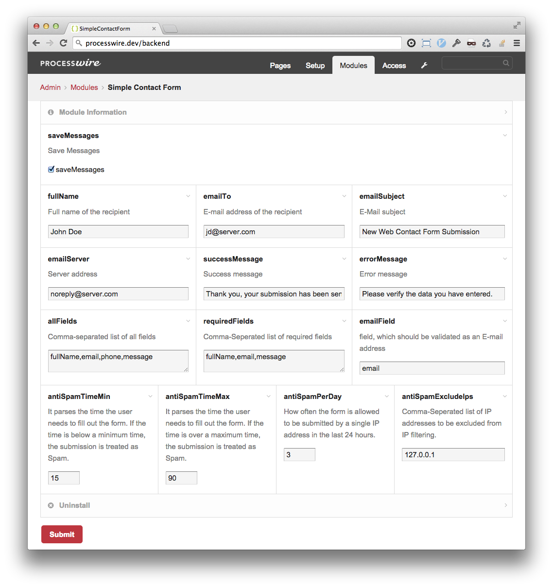

# ProcessWire SimpleContactForm

## Overview:

Just a simple contact form using Twig (TemplateTwigReplace). Not more and not less.
See the instructions here: [TemplateTwigReplace](http://modules.processwire.com/modules/template-twig-replace)

Designed for use with ProcessWire 2.4
[http://processwire.com](http://processwire.com)

## Installation and Usage:

1. Clone the module and place SimpleContactForm in your site/modules/ directory. 

```
git clone https://github.com/justonestep/processwire-simplecontactform.git your/path/site/modules/SimpleContactForm
```

2. Login to ProcessWire admin and click Modules. 
3. Click "Check for new modules".
4. Click "install" next to the new SimpleContactForm module. 
5. Enter settings similar to the example below:

```
saveMessages: whether to save received messages
fullName: Firstname Lastname
emailTo: xxx@xxx.xx
emailSubject: New Web Contact Form Submission
successMessage: Thank you, your submission has been sent
errorMessage: Please verify the data you have entered
emailServer: noreply@xxx.xx
allFields: fullName,email,message
requiredFields: fullName,email,message
emailField: email
antispamfortime: It parses the time the user needs to fill out the form. If the time is below a minimum time, the submission is treated as Spam.
```

These fields will be rendered automatically.
Therefore a new template called `simple_contact_form.twig` will be created in your `site/templates` directory.
All fields in this new template will be simple inputs temporarily.
Once created you can/should modify the template as well as the fields to your own needs, 
just make sure to maintain the names of the fields.

If `saveMessages` is enabled, a new page `scf-messages` will be created.
Also a new repeater field containing all set up fields is added.
For each received message a new repeater element is stored.
The new template `simple_contact_form_messages.twig` which is created for this page checks 
whether the current user is logged into the backend or not.
If that is the case all received messages will be listed.
Otherwise the user will be redirected to the root page.
Failing that the user will be redirected to the root page.
You can modify that templates for your own needs.

6. Create a template for your contact form page (if you don't already have one).
7. Add the fields you want to use to this template as you are used to.
8. In the template add just one line to include the form:

```
{{modules.get('SimpleContactForm').render()}}
```

9. If you want to send the form via ajax, include jquery.simplecontactform.js and call it:

```
if ($('.js-simplecontactform').length) {
	$.simplecontactform($('.js-simplecontactform'));
}
```

To get just the necessary part, modify yout template like this:

```

	{{modules.get('SimpleContactForm').render()}}

	{# normal stuff ... #}

```

## Screenshots:

**Module Settings**


